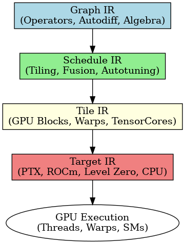
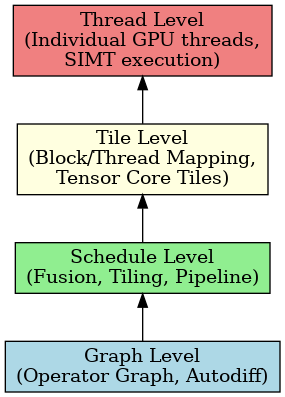

# Tessera

Tessera is a next-generation programming model and compiler stack for deep learning, HPC, and scientific workloads.  
It introduces a multi-level IR (Graph → Schedule → Tile → Target) and a DSL for operator-based modeling, enabling deterministic, scalable, and portable execution across NVIDIA, AMD, Intel, and CPU backends.

---

## 🔎 Overview Diagrams

### 1. Tessera Execution Flow



- **Graph IR**: Operator algebra, autodiff, symbolic transformations  
- **Schedule IR**: Fusion, tiling, autotuning, pipeline scheduling  
- **Tile IR**: Explicit GPU mapping (blocks, warps, Tensor Cores)  
- **Target IR**: Lowered to PTX, ROCm LLVM, Intel Level Zero, CPU LLVM  

---

### 2. Tessera Execution Hierarchy (like CUDA’s Grid/Block/Thread Pyramid)



- **Graph Level** → Operator graph, autodiff  
- **Schedule Level** → Fusion, tiling, pipeline  
- **Tile Level** → Block/thread mapping, Tensor Core tiles  
- **Thread Level** → Individual GPU threads, SIMT execution  

---

## 📚 Documentation

The full documentation set is organized by topic:

- **[Programming Guide](docs/programming_guide/)** – Core language features and usage  
- **[Performance Best Practices](docs/performance/)** – Occupancy, memory tuning, autotuning  
- **[Numerical Behavior Guide](docs/numerical/)** – Determinism, stability, mixed precision  
- **[Interop & Tooling Guide](docs/interop/)** – Python, C++, MLIR, debuggers, profilers  
- **[Hardware Mapping Guide](docs/hardware_mapping/)** – Mapping Tessera onto GPUs  
- **[Tutorials Volume](docs/tutorials/)** – Hands-on walkthroughs  
- **[Operator Reference](docs/reference/Tessera_Operator_Reference.md)** – Operator catalog  
- **[Runtime & ABI Spec](docs/runtime_abi/)** – Normative runtime and ABI specification  
- **[IR Specifications](docs/ir/)** – Graph IR, Schedule IR, Tile IR, Target IR  

---

## 🚀 Quick Example

```python
from tessera import op, dist

# Create a distributed mesh across 8 GPUs
mesh = dist.Mesh(axes=["dp"], devices=range(8))

# Define a sharded tensor
X = dist.tensor((1024, 1024), layout=dist.ShardSpec(("row",), ("dp",)), mesh=mesh)

# Apply a fused operator pipeline
Y = op.pipeline([
    op.matmul(X, X.T),
    op.relu,
    op.layernorm
])
```

---

## 📌 Repository Structure

```
tessera/
├── docs/
│   ├── overview/                 # High-level diagrams
│   ├── programming_guide/        # Main programming guide
│   ├── performance/              # Performance best practices
│   ├── numerical/                # Numerical behavior guide
│   ├── runtime_abi/              # Runtime & ABI spec
│   ├── hardware_mapping/         # GPU mapping guide
│   ├── tutorials/                # Hands-on tutorials
│   ├── interop/                  # Interop & tooling guide
│   └── reference/                # Operator reference
└── README.md                     # This file
```

---

## 🔮 Roadmap

- Expand operator libraries (cuBLAS, cuDNN, cuFFT equivalents in Tessera).  
- Add integration with Hugging Face models for inference.  
- Optimize distributed training at 128+ node scale.  
- Extend tooling (profiler, debugger, autotuner caches).  
