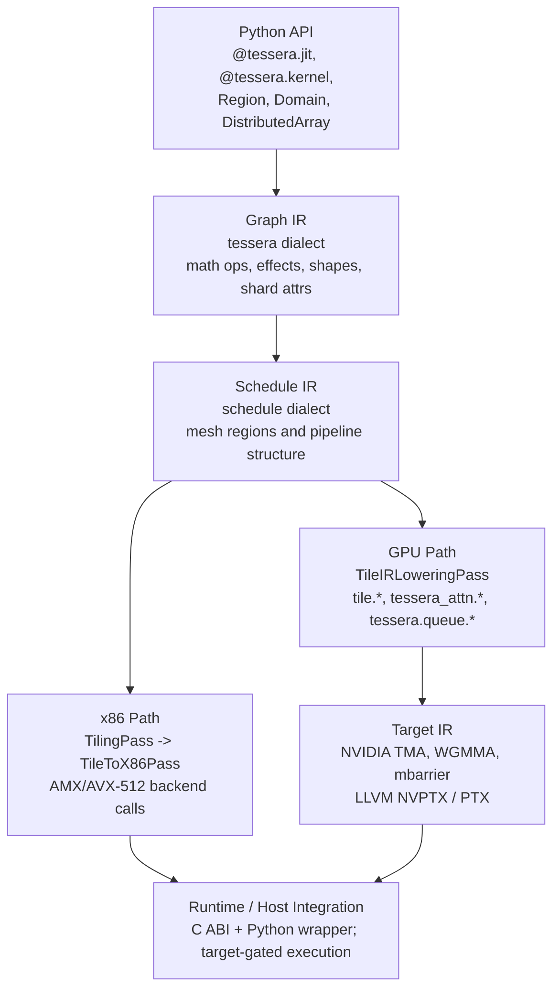

# Tessera Architecture Index

Start here for the current Tessera architecture. This page is the entry point for architecture readers; detailed behavior is specified by the canonical specs linked below.

Tessera is a pre-alpha, tile-centric programming model and compiler. The
implemented architecture now extends beyond the original Phase 1-3 framing:
the Python frontend, Graph/Schedule/Tile/Target IR stack, runtime ABI, Apple
GPU fused-kernel path, GA/EBM lanes, Visual Complex audit surface, and multiple
validation spines are live in varying degrees. Treat phase labels in older
architecture guides as design history unless a generated dashboard or canonical
spec restates the claim.

## Architecture At A Glance

## How To Read Current Status

Use the generated dashboards for status claims instead of older phase labels:
`docs/audit/generated/support_table.md` is the per-op compiler-support truth,
`docs/audit/generated/e2e_op_coverage.md` is the execution-path truth, and
`docs/spec/VALIDATION_SPINE.md` is the command/CI truth. Architecture guides
explain shape and intent; the dashboards say what is proven today.

## Current Capability Table

| Area | Current status | Primary references |
|------|----------------|--------------------|
| Python frontend + Graph IR | Implemented and documented; `fn.explain()`, `from_text`, support queries, and typed diagnostics are the current developer surface. | `docs/spec/PYTHON_API_SPEC.md`, `docs/reference/tessera-api-reference.md`, `docs/spec/GRAPH_IR_SPEC.md` |
| Schedule / Tile / Target IR | Implemented as inspectable compiler layers; some target paths are artifact-only or hardware-gated. | `docs/spec/COMPILER_REFERENCE.md`, `docs/spec/LOWERING_PIPELINE_SPEC.md`, `docs/spec/TARGET_IR_SPEC.md` |
| Runtime ABI | C ABI and Python wrapper exist; smoke and sanitizer coverage guard lifecycle and handle behavior. | `docs/spec/RUNTIME_ABI_SPEC.md`, `docs/spec/VALIDATION_SPINE.md` |
| Native/runtime execution | Complete for a small audited subset; most ops are CPU-reference or artifact-only today. | `docs/audit/generated/e2e_op_coverage.md`, `docs/audit/generated/support_table.md` |
| Distributed / collective surfaces | Lowering, adapter, and validation surfaces exist; production multi-rank readiness is target-gated. | `docs/spec/CONFORMANCE.md`, `docs/spec/VALIDATION_SPINE.md` |
| GA / EBM / Visual Complex lanes | Public constrained lanes with audit visibility; native coverage differs by family and target. | `docs/status/ga_ebm.md`, `docs/status/visual_complex.md` |

## Canonical Specs

| Question | Source of truth |
|----------|-----------------|
| What API names are current? | `docs/CANONICAL_API.md` |
| What is the compiler architecture and pass registry? | `docs/spec/COMPILER_REFERENCE.md` |
| What Python symbols exist? | `docs/spec/PYTHON_API_SPEC.md` |
| What does Graph IR mean? | `docs/spec/GRAPH_IR_SPEC.md` |
| What does each lowering pass consume and produce? | `docs/spec/LOWERING_PIPELINE_SPEC.md` |
| What are Schedule IR, Tile IR, and Target IR dialects? | `docs/spec/TARGET_IR_SPEC.md` |
| What is the runtime ABI contract? | `docs/spec/RUNTIME_ABI_SPEC.md` |
| What is conformant today vs planned? | `docs/spec/CONFORMANCE.md` |

## Architecture Guides

| Document | Use it for |
|----------|------------|
| `docs/architecture/system_overview.md` | Narrative overview, component map, and current what-works table |
| `docs/architecture/Compiler/Tessera_Compiler_Architecture_Overview.md` | Compiler walkthrough from Python surface to target lowering |
| `docs/architecture/Compiler/Tessera_Compiler_Frontend_Design_GraphIR.md` | Python frontend and Graph IR emission design |
| `docs/architecture/Compiler/Tessera_Compiler_ScheduleIR_Design.md` | Schedule IR design and planned scheduling concepts |
| `docs/architecture/Compiler/Tessera_Compiler_TileIR_Design.md` | Tile IR design, memory movement, MMA, and barriers |
| `docs/architecture/Compiler/Tessera_Compiler_TargetIR_Design.md` | Target IR design and backend mapping concepts |
| `docs/architecture/tessera_target_ir_usage_guide.md` | Informative target-lowering examples; defer API claims to canonical specs |
| `docs/architecture/workloads/` | Cross-target workload architecture: attention family, DFlash, and MSA |
| `docs/architecture/distributed/megamoe.md` | Distributed MegaMoE architecture |
| `docs/architecture/inference/serving.md` | Inference-serving orchestration plan |
| `docs/backends/` | Per-target architecture, implementation guides, and links to evidence |
| `docs/architecture/proposals/cute_tessera_enhancement.md` | Proposal material for CuTe-inspired enhancements |

## Historical Material

Pre-canonical architecture material lives in `archive/docs/old_concepts/` or `archive/docs/pre_canonical/`. It is retained for design history only. Do not use archived documents as implementation guidance unless the canonical specs explicitly restore a concept.

## Rules For New Architecture Docs

- Link back to this index and to the relevant canonical spec.
- Use the canonical IR names: Graph IR, Schedule IR, Tile IR, Target IR.
- Mark implementation claims with the status labels in `docs/README.md`.
- Use current public APIs from `docs/CANONICAL_API.md`.
- Keep proposals marked as `classification: Proposal`.
