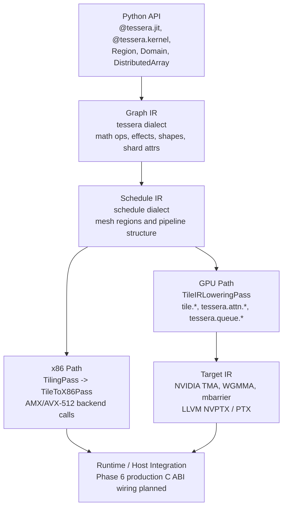

# Tessera Architecture Index

Start here for the current Tessera architecture. This page is the entry point for architecture readers; detailed behavior is specified by the canonical specs linked below.

Tessera is a pre-alpha, tile-centric programming model and compiler. The current implemented architecture covers Phases 1-3: Python frontend, x86 lowering, and NVIDIA SM_90+ GPU lowering for supported paths. Distributed training, extended autodiff/checkpointing/autotuning, and production runtime wiring are planned in later phases.

## Architecture At A Glance

## Current Phase Table

| Phase | Scope | Status | Primary references |
|-------|-------|--------|--------------------|
| Phase 1 | Python frontend: `@tessera.jit`, `@tessera.kernel`, `Region`, domains/distributions, constraints, effects, Graph IR emission | Complete | `docs/CANONICAL_API.md`, `docs/spec/PYTHON_API_SPEC.md`, `docs/spec/GRAPH_IR_SPEC.md` |
| Phase 2 | x86 lowering: distribution lowering, canonicalization, tiling, AMX/AVX-512 backend calls | Complete | `docs/spec/COMPILER_REFERENCE.md`, `docs/spec/LOWERING_PIPELINE_SPEC.md` |
| Phase 3 | NVIDIA GPU lowering: GPU target profile, FA-4 Tile IR, warp specialization, async copy lowering, WGMMA/TMA target lowering | Complete | `docs/spec/TARGET_IR_SPEC.md`, `docs/spec/LOWERING_PIPELINE_SPEC.md` |
| Phase 4 | Distributed training: NCCL/RCCL collectives, TPU StableHLO, Cyclic distribution, pipeline parallelism | Planned | `docs/spec/COMPILER_REFERENCE.md`, `docs/spec/TARGET_IR_SPEC.md` |
| Phase 5 | Scaling and resilience: autodiff expansion, activation checkpointing, ZeRO sharding, Bayesian autotuning | Planned | `docs/README.md`, `docs/spec/COMPILER_REFERENCE.md` |
| Phase 6 | Production runtime: Runtime C ABI wiring, Python runtime wrapper, ROCm MFMA completion, benchmark suite | Planned | `docs/spec/RUNTIME_ABI_SPEC.md`, `docs/spec/01_conformance.md` |

## Canonical Specs

| Question | Source of truth |
|----------|-----------------|
| What API names are current? | `docs/CANONICAL_API.md` |
| What is the compiler architecture and pass registry? | `docs/spec/COMPILER_REFERENCE.md` |
| What Python symbols exist? | `docs/spec/PYTHON_API_SPEC.md` |
| What does Graph IR mean? | `docs/spec/GRAPH_IR_SPEC.md` |
| What does each lowering pass consume and produce? | `docs/spec/LOWERING_PIPELINE_SPEC.md` |
| What are Schedule IR, Tile IR, and Target IR dialects? | `docs/spec/TARGET_IR_SPEC.md` |
| What is the runtime ABI contract? | `docs/spec/RUNTIME_ABI_SPEC.md` |
| What is conformant today vs planned? | `docs/spec/01_conformance.md` |

## Architecture Guides

| Document | Use it for |
|----------|------------|
| `docs/architecture/system_overview.md` | Narrative overview, component map, and current what-works table |
| `docs/architecture/Compiler/Tessera_Compiler_Architecture_Overview.md` | Compiler walkthrough from Python surface to target lowering |
| `docs/architecture/Compiler/Tessera_Compiler_Frontend_Design_GraphIR.md` | Python frontend and Graph IR emission design |
| `docs/architecture/Compiler/Tessera_Compiler_ScheduleIR_Design.md` | Schedule IR design and planned scheduling concepts |
| `docs/architecture/Compiler/Tessera_Compiler_TileIR_Design.md` | Tile IR design, memory movement, MMA, and barriers |
| `docs/architecture/Compiler/Tessera_Compiler_TargetIR_Design.md` | Target IR design and backend mapping concepts |
| `docs/architecture/tessera_target_ir_usage_guide.md` | Informative target-lowering examples; defer API claims to canonical specs |
| `docs/architecture/cute_tessera_enhancement.md` | Proposal material for CuTe-inspired enhancements |

## Historical Material

Pre-canonical architecture material lives in `docs/old_concepts/` or `docs/archive/pre_canonical/`. It is retained for design history only. Do not use archived documents as implementation guidance unless the canonical specs explicitly restore a concept.

## Rules For New Architecture Docs

- Link back to this index and to the relevant canonical spec.
- Use the canonical IR names: Graph IR, Schedule IR, Tile IR, Target IR.
- Mark future behavior with phase labels: Phase 4 planned, Phase 5 planned, or Phase 6 planned.
- Use current public APIs from `docs/CANONICAL_API.md`.
- Keep proposals marked as `classification: Proposal`.
