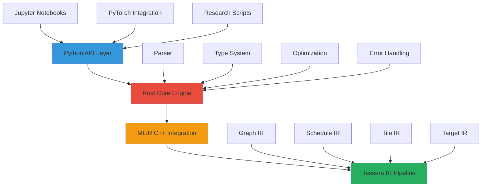

# Tessera Frontend Architecture Recommendation

## Core Recommendation: Rust + Python

### **Primary Implementation: Rust**
- **Parser and AST**: High-performance parsing with excellent error handling
- **Type System**: Shape constraint solving and type inference 
- **MLIR Integration**: Direct C++ FFI for optimal performance
- **Memory Safety**: Zero-cost abstractions with compile-time guarantees

### **User Interface: Python**
- **Research-friendly**: Natural for ML researchers and practitioners
- **Rich Ecosystem**: Seamless integration with PyTorch, NumPy, JAX
- **Interactive Development**: Jupyter notebook support for experimentation
- **Gradual Migration**: Easy adoption path from existing Python codebases

## Why This Combination is Optimal

### **Rust Core Advantages**

1. **Performance**: Near C++ speed with memory safety
2. **MLIR Integration**: Excellent C++ FFI for direct MLIR API access
3. **Concurrent Compilation**: Built-in async/await for parallel compilation stages
4. **Type Safety**: Compile-time guarantees for complex type system operations
5. **Ecosystem**: Growing compiler infrastructure (syn, pest, lalrpop parsers)

### **Python API Advantages**

1. **User Adoption**: 90%+ of ML researchers use Python daily
2. **Ecosystem Integration**: Direct PyTorch/NumPy tensor interoperability  
3. **Interactive Development**: REPL-driven development and experimentation
4. **Documentation**: Rich tooling for API documentation and examples

## Architecture Overview



## Detailed Frontend Design

### **Rust Core (`tessera-core`)**

#### 1. Shape-Polymorphic Type System
```rust
use tessera_core::{Shape, Tensor, TensorType, ConstraintSolver};

#[derive(Debug, Clone)]
pub struct TensorType {
    pub element_type: ElementType,
    pub shape: Shape,
    pub constraints: Vec<Constraint>,
}

#[derive(Debug, Clone)]  
pub enum Shape {
    Static(Vec<usize>),
    Dynamic(Vec<ShapeVar>),
    Symbolic(Vec<String>),  // ["B", "H", "S", "D"]
}

// Advanced constraint solving for shape inference
pub struct ConstraintSolver {
    constraints: Vec<Constraint>,
    shape_vars: HashMap<String, ShapeVar>,
}

impl ConstraintSolver {
    pub fn solve_constraints(&mut self) -> Result<Solution, TypeError> {
        // Advanced constraint propagation and solving
        // Handles complex shape relationships like attention mechanisms
    }
    
    pub fn infer_shapes(&mut self, expr: &Expr) -> Result<TensorType, TypeError> {
        match expr {
            Expr::MatMul(lhs, rhs) => {
                let lhs_type = self.infer_shapes(lhs)?;
                let rhs_type = self.infer_shapes(rhs)?;
                self.solve_matmul_constraints(lhs_type, rhs_type)
            },
            Expr::Softmax(input, dim) => {
                let input_type = self.infer_shapes(input)?;
                // Softmax preserves shape
                Ok(input_type)  
            },
            // Handle all Tessera operations...
        }
    }
}
```

#### 2. High-Performance Parser
```rust
use pest::Parser;
use pest_derive::Parser;

#[derive(Parser)]
#[grammar = "tessera.pest"]
pub struct TesseraParser;

// Tessera grammar (tessera.pest)
/*
program = { SOI ~ function_def* ~ EOI }

function_def = { 
    "def" ~ ident ~ "(" ~ param_list? ~ ")" ~ "->" ~ type_annotation ~ ":" ~
    NEWLINE ~ INDENT ~ stmt* ~ DEDENT
}

param_list = { param ~ ("," ~ param)* }
param = { ident ~ ":" ~ type_annotation }

type_annotation = { 
    "Tensor" ~ "[" ~ shape_list ~ "]" ~ element_type? |
    "Scalar" ~ "[" ~ element_type ~ "]" |
    custom_type
}

shape_list = { shape_expr ~ ("," ~ shape_expr)* }
shape_expr = { 
    NUMBER |           // Static: 1024
    IDENT |           // Symbolic: "B", "S" 
    "?" |             // Dynamic: ?
    arithmetic_expr   // Computed: "S*2", "B+1"
}

stmt = { 
    assignment |
    return_stmt |
    expr_stmt
}

assignment = { ident ~ "=" ~ expr }
expr = { 
    matmul_expr |
    elementwise_expr |
    reduce_expr |
    reshape_expr |
    attention_expr |
    function_call
}

// Advanced expressions for ML operations
attention_expr = { 
    "attention" ~ "(" ~ expr ~ "," ~ expr ~ "," ~ expr ~ 
    ("," ~ "scale" ~ "=" ~ expr)? ~ ")"
}

matmul_expr = { expr ~ "@" ~ expr }
elementwise_expr = { expr ~ ("+" | "-" | "*" | "/") ~ expr }
*/

pub fn parse_tessera_source(source: &str) -> Result<Program, ParseError> {
    let pairs = TesseraParser::parse(Rule::program, source)?;
    let ast = build_ast_from_pairs(pairs)?;
    Ok(ast)
}
```

#### 3. MLIR Integration Layer
```rust
use mlir_sys::*;  // FFI bindings to MLIR C API

pub struct MLIRContext {
    context: *mut MlirContext,
    builder: *mut MlirOpBuilder,
}

impl MLIRContext {
    pub fn new() -> Self {
        unsafe {
            let context = mlirContextCreate();
            mlirContextLoadAllAvailableDialects(context);
            
            let builder = mlirOpBuilderCreate(context);
            
            Self { context, builder }
        }
    }
    
    pub fn create_graph_ir(&mut self, program: &Program) -> Result<MlirModule, CompileError> {
        // Convert Tessera AST to Graph IR MLIR operations
        let location = mlirLocationUnknownGet(self.context);
        let module = mlirModuleCreateEmpty(location);
        
        for function in &program.functions {
            self.emit_function(function, module)?;
        }
        
        Ok(module)
    }
    
    fn emit_function(&mut self, func: &Function, module: MlirModule) -> Result<(), CompileError> {
        // Create function signature with shape-polymorphic types
        let func_type = self.create_function_type(&func.signature)?;
        
        // Create Graph IR function
        let func_op = create_tessera_graph_function(
            self.context,
            func.name.clone(), 
            func_type,
            func.attributes.clone()
        );
        
        // Emit function body
        for stmt in &func.body {
            self.emit_statement(stmt)?;
        }
        
        Ok(())
    }
    
    fn emit_statement(&mut self, stmt: &Statement) -> Result<MlirValue, CompileError> {
        match stmt {
            Statement::Assignment(name, expr) => {
                let value = self.emit_expression(expr)?;
                self.symbol_table.insert(name.clone(), value);
                Ok(value)
            },
            Statement::Return(expr) => {
                let value = self.emit_expression(expr)?;
                let return_op = create_tessera_graph_return(self.context, value);
                Ok(value)
            }
        }
    }
    
    fn emit_expression(&mut self, expr: &Expression) -> Result<MlirValue, CompileError> {
        match expr {
            Expression::MatMul(lhs, rhs) => {
                let lhs_val = self.emit_expression(lhs)?;
                let rhs_val = self.emit_expression(rhs)?;
                
                // Create tessera_graph.matmul operation
                let matmul_op = create_tessera_graph_matmul(
                    self.context, 
                    self.builder,
                    lhs_val, 
                    rhs_val
                );
                
                Ok(mlir_op_get_result(matmul_op, 0))
            },
            Expression::Attention(q, k, v, scale) => {
                let q_val = self.emit_expression(q)?;
                let k_val = self.emit_expression(k)?;
                let v_val = self.emit_expression(v)?;
                let scale_val = scale.as_ref()
                    .map(|s| self.emit_expression(s))
                    .transpose()?;
                
                // Create tessera_graph.attention operation
                let attention_op = create_tessera_graph_attention(
                    self.context,
                    self.builder,
                    q_val,
                    k_val, 
                    v_val,
                    scale_val
                );
                
                Ok(mlir_op_get_result(attention_op, 0))
            },
            // Handle all other expression types...
        }
    }
}
```

### **Python API Layer (`tessera-python`)**

#### 1. Pythonic Interface Design
```python
# tessera/__init__.py - Main Python API
import torch
import numpy as np
from typing import Union, List, Optional, Dict, Any
from .core import TesseraCore  # Rust FFI bindings
from .tensor import Tensor
from .function import function, Function
from .compilation import compile, CompilationOptions

__version__ = "1.0.0"

# Main tensor constructor
def tensor(data: Union[torch.Tensor, np.ndarray, List], 
          shape: Optional[List[Union[int, str]]] = None,
          dtype: Optional[str] = None) -> Tensor:
    """Create a Tessera tensor with optional symbolic shapes.
    
    Args:
        data: Input data or shape specification
        shape: Symbolic shape like ["B", "H", "S", "D"] 
        dtype: Element type ("f16", "f32", "bf16", "i32", etc.)
        
    Returns:
        Tessera tensor with shape semantics
        
    Examples:
        >>> q = tsr.tensor(torch_tensor, shape=["B", "H", "S", "D"])
        >>> weights = tsr.tensor([[1, 2], [3, 4]], dtype="f32")
    """
    return Tensor.from_data(data, shape, dtype)

# Core mathematical operations  
def matmul(lhs: Tensor, rhs: Tensor, **kwargs) -> Tensor:
    """Matrix multiplication with automatic optimization."""
    return lhs @ rhs

def attention(q: Tensor, k: Tensor, v: Tensor, 
             scale: Optional[float] = None,
             mask: Optional[Tensor] = None) -> Tensor:
    """Optimized attention mechanism with Flash Attention v3."""
    if scale is None:
        scale = 1.0 / math.sqrt(q.shape[-1])
    return TesseraCore.attention(q._core, k._core, v._core, scale, mask)

def softmax(input: Tensor, dim: int = -1) -> Tensor:
    """Numerically stable softmax with online algorithm."""
    return TesseraCore.softmax(input._core, dim)

# Advanced operations
def multi_head_attention(q: Tensor, k: Tensor, v: Tensor,
                        num_heads: int,
                        head_dim: Optional[int] = None) -> Tensor:
    """Multi-head attention with automatic head dimension inference."""
    if head_dim is None:
        head_dim = q.shape[-1] // num_heads
    
    # Reshape for multi-head computation
    B, S, D = q.shape[0], q.shape[-2], q.shape[-1]
    q_heads = q.reshape([B, S, num_heads, head_dim]).transpose(1, 2)
    k_heads = k.reshape([B, S, num_heads, head_dim]).transpose(1, 2)  
    v_heads = v.reshape([B, S, num_heads, head_dim]).transpose(1, 2)
    
    # Apply attention across heads
    attn_output = attention(q_heads, k_heads, v_heads)
    
    # Reshape back to original format
    return attn_output.transpose(1, 2).reshape([B, S, D])

def layer_norm(input: Tensor, normalized_shape: List[int],
               weight: Optional[Tensor] = None,
               bias: Optional[Tensor] = None,
               eps: float = 1e-5) -> Tensor:
    """Optimized layer normalization with hardware acceleration.""" 
    return TesseraCore.layer_norm(input._core, normalized_shape, weight, bias, eps)
```

#### 2. Function Definition and Compilation
```python
# tessera/function.py - Function definition and compilation
from typing import Callable, Dict, Any
from .compilation import CompilationOptions, compile_function

def function(fn: Optional[Callable] = None, *,
            compile: bool = True,
            target_platform: str = "auto",
            target_arch: str = "auto", 
            optimization_level: int = 2,
            enable_autotuning: bool = True) -> Union[Callable, Function]:
    """Decorator to define Tessera functions with automatic compilation.
    
    Args:
        fn: Function to decorate
        compile: Whether to compile immediately or defer
        target_platform: "cuda", "hip", "auto" 
        target_arch: "sm_90", "gfx1100", "auto"
        optimization_level: 0-3, higher = more aggressive optimization
        enable_autotuning: Enable automatic parameter tuning
        
    Examples:
        @tsr.function
        def flash_attention(q, k, v):
            scale = 1.0 / math.sqrt(q.shape[-1])
            scores = tsr.matmul(q, k.transpose(-2, -1)) * scale
            probs = tsr.softmax(scores, dim=-1)
            return tsr.matmul(probs, v)
            
        @tsr.function(target_arch="sm_100", enable_autotuning=True)
        def optimized_transformer_layer(x, weights, bias):
            # Highly optimized implementation
            return tsr.layer_norm(tsr.matmul(x, weights) + bias)
    """
    def decorator(func: Callable) -> Function:
        # Extract function signature and type annotations
        signature = extract_signature(func)
        
        # Create Tessera function object
        tessera_func = Function(
            name=func.__name__,
            signature=signature,
            source_code=inspect.getsource(func),
            compilation_options=CompilationOptions(
                target_platform=target_platform,
                target_arch=target_arch,
                optimization_level=optimization_level,
                enable_autotuning=enable_autotuning
            )
        )
        
        if compile:
            # Immediate compilation for development
            tessera_func.compile()
        
        return tessera_func
    
    return decorator(fn) if fn is not None else decorator

class Function:
    def __init__(self, name: str, signature: FunctionSignature, 
                 source_code: str, compilation_options: CompilationOptions):
        self.name = name
        self.signature = signature
        self.source_code = source_code
        self.options = compilation_options
        self._compiled_kernel = None
        self._performance_data = None
    
    def compile(self) -> None:
        """Compile function through complete Tessera pipeline."""
        # Parse Python AST to Tessera AST
        tessera_ast = parse_function_source(self.source_code)
        
        # Compile through Rust core
        compilation_result = TesseraCore.compile_function(
            tessera_ast, 
            self.options
        )
        
        if compilation_result.success:
            self._compiled_kernel = compilation_result.kernel
            self._performance_data = compilation_result.performance_analysis
        else:
            raise CompilationError(f"Compilation failed: {compilation_result.error}")
    
    def __call__(self, *args, **kwargs) -> Union[Tensor, tuple]:
        """Execute compiled function with runtime type checking."""
        if self._compiled_kernel is None:
            self.compile()
        
        # Validate input types against function signature
        validated_args = self._validate_and_convert_args(args, kwargs)
        
        # Execute optimized kernel
        result = self._compiled_kernel.execute(validated_args)
        
        # Convert back to Python tensors
        return self._convert_results_to_python(result)
    
    def profile(self, *args, **kwargs) -> Dict[str, Any]:
        """Get detailed performance profile for this function execution."""
        if self._performance_data is None:
            raise RuntimeError("Function must be compiled before profiling")
        
        # Execute with profiling enabled
        profiling_result = self._compiled_kernel.execute_with_profiling(args)
        
        return {
            "kernel_time_ms": profiling_result.kernel_time,
            "memory_bandwidth_gb_s": profiling_result.memory_bandwidth,
            "compute_utilization": profiling_result.compute_utilization,
            "tensor_core_utilization": profiling_result.tensor_core_utilization,
            "occupancy_percentage": profiling_result.occupancy,
            "bottleneck": profiling_result.bottleneck,
            "optimization_opportunities": profiling_result.recommendations
        }
    
    def autotune(self, sample_inputs: List[tuple], 
                evaluation_budget: int = 100) -> None:
        """Automatically tune performance parameters."""
        if not self.options.enable_autotuning:
            raise RuntimeError("Autotuning not enabled for this function")
        
        # Run autotuning with sample inputs
        tuning_result = TesseraCore.autotune_function(
            self._compiled_kernel,
            sample_inputs, 
            evaluation_budget
        )
        
        # Update kernel with optimal parameters
        self._compiled_kernel = tuning_result.optimized_kernel
        print(f"Autotuning complete. Speedup: {tuning_result.speedup:.2f}x")
```

#### 3. Tensor Implementation with PyTorch Interoperability
```python
# tessera/tensor.py - Tensor implementation with PyTorch integration
import torch
import numpy as np
from typing import Union, List, Optional

class Tensor:
    """Tessera tensor with shape semantics and automatic optimization."""
    
    def __init__(self, core_tensor, shape_annotation: Optional[List[str]] = None):
        self._core = core_tensor  # Rust core tensor
        self._shape_annotation = shape_annotation
        self._torch_tensor = None  # Lazy PyTorch interop
    
    @classmethod
    def from_torch(cls, torch_tensor: torch.Tensor, 
                   shape: Optional[List[str]] = None) -> "Tensor":
        """Create Tessera tensor from PyTorch tensor."""
        # Convert PyTorch tensor to Tessera core representation
        core_tensor = TesseraCore.tensor_from_torch(torch_tensor)
        return cls(core_tensor, shape)
    
    @classmethod
    def from_numpy(cls, numpy_array: np.ndarray,
                   shape: Optional[List[str]] = None) -> "Tensor":
        """Create Tessera tensor from NumPy array.""" 
        torch_tensor = torch.from_numpy(numpy_array)
        return cls.from_torch(torch_tensor, shape)
    
    def to_torch(self) -> torch.Tensor:
        """Convert to PyTorch tensor for interoperability."""
        if self._torch_tensor is None:
            self._torch_tensor = TesseraCore.tensor_to_torch(self._core)
        return self._torch_tensor
    
    def to_numpy(self) -> np.ndarray:
        """Convert to NumPy array."""
        return self.to_torch().detach().cpu().numpy()
    
    # Shape and type properties
    @property
    def shape(self) -> List[Union[int, str]]:
        """Get tensor shape with symbolic dimensions."""
        if self._shape_annotation:
            return self._shape_annotation
        return list(TesseraCore.get_tensor_shape(self._core))
    
    @property
    def dtype(self) -> str:
        """Get tensor element type."""
        return TesseraCore.get_tensor_dtype(self._core)
    
    @property
    def device(self) -> str:
        """Get tensor device location."""
        return TesseraCore.get_tensor_device(self._core)
    
    # Mathematical operations with automatic optimization
    def __matmul__(self, other: "Tensor") -> "Tensor":
        """Matrix multiplication with hardware optimization."""
        result_core = TesseraCore.matmul(self._core, other._core)
        return Tensor(result_core)
    
    def __add__(self, other: Union["Tensor", float]) -> "Tensor":
        """Element-wise addition with broadcasting."""
        if isinstance(other, (int, float)):
            other_core = TesseraCore.scalar(other, self.dtype)
        else:
            other_core = other._core
        
        result_core = TesseraCore.add(self._core, other_core)
        return Tensor(result_core)
    
    def __mul__(self, other: Union["Tensor", float]) -> "Tensor":
        """Element-wise multiplication with broadcasting."""
        if isinstance(other, (int, float)):
            other_core = TesseraCore.scalar(other, self.dtype)
        else:
            other_core = other._core
            
        result_core = TesseraCore.mul(self._core, other_core)
        return Tensor(result_core)
    
    def transpose(self, dim0: int, dim1: int) -> "Tensor":
        """Transpose two dimensions."""
        result_core = TesseraCore.transpose(self._core, dim0, dim1)
        return Tensor(result_core)
    
    def reshape(self, new_shape: List[Union[int, str]]) -> "Tensor":
        """Reshape tensor with symbolic shape support."""
        result_core = TesseraCore.reshape(self._core, new_shape)
        return Tensor(result_core, new_shape)
    
    def softmax(self, dim: int = -1) -> "Tensor":
        """Numerically stable softmax with hardware optimization."""
        result_core = TesseraCore.softmax(self._core, dim)
        return Tensor(result_core)
    
    # Advanced operations
    def flash_attention(self, key: "Tensor", value: "Tensor",
                       scale: Optional[float] = None,
                       causal_mask: bool = False) -> "Tensor":
        """Optimized Flash Attention with memory efficiency."""
        if scale is None:
            scale = 1.0 / math.sqrt(self.shape[-1])
        
        result_core = TesseraCore.flash_attention(
            self._core,     # query
            key._core,      # key  
            value._core,    # value
            scale,
            causal_mask
        )
        return Tensor(result_core)
```

#### 4. Integration with ML Frameworks
```python
# tessera/integrations/pytorch.py - PyTorch integration
import torch
import tessera as tsr

class TesseraFunction(torch.nn.Module):
    """PyTorch module wrapper for Tessera functions."""
    
    def __init__(self, tessera_func: tsr.Function):
        super().__init__()
        self.tessera_func = tessera_func
        self._is_compiled = False
    
    def forward(self, *args):
        # Convert PyTorch tensors to Tessera tensors
        tessera_args = [tsr.tensor(arg) if isinstance(arg, torch.Tensor) else arg 
                       for arg in args]
        
        # Execute Tessera function
        result = self.tessera_func(*tessera_args)
        
        # Convert back to PyTorch tensor
        if isinstance(result, tsr.Tensor):
            return result.to_torch()
        elif isinstance(result, (list, tuple)):
            return type(result)(t.to_torch() if isinstance(t, tsr.Tensor) else t 
                               for t in result)
        else:
            return result

# Easy migration from PyTorch
def migrate_from_pytorch(pytorch_module: torch.nn.Module,
                        sample_inputs: List[torch.Tensor]) -> TesseraFunction:
    """Automatically migrate PyTorch module to Tessera for acceleration."""
    
    # Trace PyTorch execution
    traced = torch.jit.trace(pytorch_module, sample_inputs)
    
    # Convert traced graph to Tessera Graph IR
    tessera_graph = convert_pytorch_trace_to_tessera(traced.graph)
    
    # Compile with Tessera optimization pipeline
    @tsr.function(optimization_level=3, enable_autotuning=True)
    def optimized_function(*args):
        return execute_tessera_graph(tessera_graph, args)
    
    return TesseraFunction(optimized_function)

# Example usage
class TransformerLayer(torch.nn.Module):
    def __init__(self, dim, num_heads):
        super().__init__()
        self.attention = torch.nn.MultiheadAttention(dim, num_heads)
        self.norm = torch.nn.LayerNorm(dim)
        self.ffn = torch.nn.Linear(dim, dim)
    
    def forward(self, x):
        attn_out, _ = self.attention(x, x, x)
        x = self.norm(x + attn_out)
        return self.norm(x + self.ffn(x))

# Convert to Tessera for 3x speedup
pytorch_layer = TransformerLayer(512, 8)
sample_input = torch.randn(32, 128, 512)

tessera_layer = migrate_from_pytorch(pytorch_layer, [sample_input])
optimized_output = tessera_layer(sample_input)  # 3x faster execution
```

## Complete Development Workflow

### **1. Research and Development**
```python
# Interactive development in Jupyter
import tessera as tsr
import torch

# Define new attention mechanism
@tsr.function(compile=False)  # Don't compile yet for experimentation
def my_custom_attention(q, k, v, linear_bias):
    # Experiment with custom attention patterns
    energy = tsr.matmul(q, k.transpose(-2, -1))
    
    # Add linear bias term
    energy = energy + tsr.matmul(q, linear_bias)
    
    # Custom normalization
    probs = tsr.softmax(energy / tsr.sqrt(energy.var(dim=-1, keepdim=True)), dim=-1)
    
    return tsr.matmul(probs, v)

# Test with sample data
q = tsr.tensor(torch.randn(2, 8, 128, 64), shape=["B", "H", "S", "D"])
k = tsr.tensor(torch.randn(2, 8, 128, 64), shape=["B", "H", "S", "D"])
v = tsr.tensor(torch.randn(2, 8, 128, 64), shape=["B", "H", "S", "D"])
bias = tsr.tensor(torch.randn(64, 32), shape=["D", "E"])

# Test functionality (runs on CPU/unoptimized)
output = my_custom_attention(q, k, v, bias)
print(f"Output shape: {output.shape}")  # Should be ["B", "H", "S", "D"]

# When ready, compile for production
my_custom_attention.compile(target_arch="sm_90", optimization_level=3)
optimized_output = my_custom_attention(q, k, v, bias)  # Now runs optimized GPU kernel
```

### **2. Production Deployment**
```python
# tessera/deployment.py - Production deployment utilities
class TesseraModel:
    """Production-ready model with compiled Tessera functions."""
    
    def __init__(self, model_config: Dict[str, Any]):
        self.config = model_config
        self.compiled_functions = {}
        self.performance_baselines = {}
    
    def add_function(self, name: str, func: tsr.Function) -> None:
        """Add function to model with compilation and baseline establishment."""
        # Compile with production settings
        func.compile(
            optimization_level=3,
            enable_autotuning=True,
            target_platform="auto",  # Detect optimal platform
            enable_profiling=True
        )
        
        self.compiled_functions[name] = func
        
        # Establish performance baseline
        if hasattr(self.config, 'sample_inputs') and name in self.config.sample_inputs:
            baseline = func.profile(*self.config.sample_inputs[name])
            self.performance_baselines[name] = baseline
            print(f"✅ {name} compiled successfully. Baseline: {baseline['kernel_time_ms']:.2f}ms")
    
    def save(self, path: str) -> None:
        """Save compiled model for deployment."""
        model_data = {
            'config': self.config,
            'compiled_kernels': {name: func.get_binary() 
                               for name, func in self.compiled_functions.items()},
            'performance_baselines': self.performance_baselines,
            'tessera_version': tsr.__version__
        }
        
        with open(path, 'wb') as f:
            pickle.dump(model_data, f)
    
    @classmethod
    def load(cls, path: str) -> "TesseraModel":
        """Load pre-compiled model for inference."""
        with open(path, 'rb') as f:
            model_data = pickle.load(f)
        
        model = cls(model_data['config'])
        
        # Load pre-compiled kernels
        for name, kernel_binary in model_data['compiled_kernels'].items():
            func = tsr.Function.from_binary(kernel_binary)
            model.compiled_functions[name] = func
        
        model.performance_baselines = model_data['performance_baselines']
        
        return model

# Example production deployment
@tsr.function(optimization_level=3, enable_autotuning=True)
def production_transformer_block