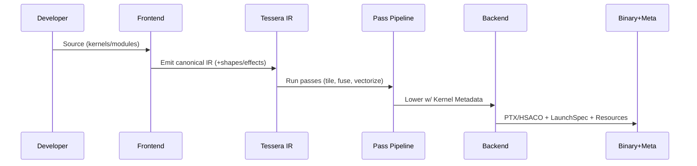
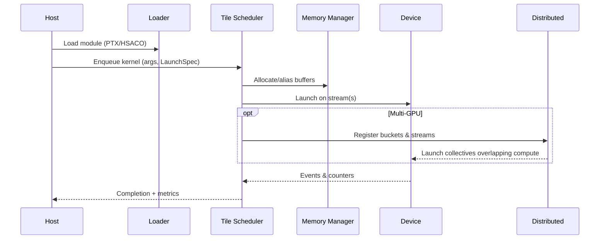

# Tessera System Architecture
**Version:** 1.0 • **Date:** 2025-09-01
**Status:** Informative (normative interfaces are flagged accordingly)  
**Audience:** Compiler/runtime engineers, kernel authors, systems & infra teams.

---

## 0. Abstract
Tessera is a tile‑centric programming model and toolchain for high‑performance AI/HPC kernels. This document describes the end‑to‑end system architecture: language/front‑end, mid‑end IR and pass pipeline, backends, runtime/ABI, distributed services, memory and scheduling, tooling, and operational concerns. It complements and references: `Tessera_Programming_Model_V1.md`, `tessera_frontend_architecture.md`, `tessera_target_ir_complete_unified.md`, `tessera_target_ir_usage_guide.md`, `Tessera_Standard_Operations.md`, and `system_overview.md`.

---

## 1. Goals & Non‑Goals
### Goals
- **Portable peak:** Map a single tile abstraction efficiently across NVIDIA/AMD/CPU backends.
- **Deterministic pipelines:** Reproducible micro‑benchmarks and training runs (fixed Philox seed).
- **Composability:** Fused epilogues, multi‑stage async pipelines, and distributed overlap.
- **Inspectability:** First‑class metrics, NVTX ranges, and IR dumps at every stage.
- **Integrability:** Embeddable runtime with a minimal C ABI and Python bindings.

### Non‑Goals
- Replace full frameworks; Tessera supplies kernels + runtime surfaces, not training ecosystems.
- Kernel auto‑synthesis. Tessera provides hooks for autotuning, but no search engine is mandated.

---

## 2. Architecture at a Glance
```mermaid
graph LR
  subgraph Authoring
    A[Language & DSL\n(Tessera Source)] --> B[Frontend\nParser + Type/Shape]
  end
  subgraph Compilation
    B --> C[Tessera IR\nCore + Dialects]
    C --> D[Pass Pipeline\nLegalize/Tile/Fuse/Vectorize]
    D --> E[Backends\nNVIDIA PTX | AMD GCN | CPU SIMD]
    E --> F[Binary Artifacts\n(PTX, HSACO, Obj, Metadata)]
  end
  subgraph Runtime
    F --> G[Module Loader]
    G --> H[Tile Scheduler & Streams]
    H --> I[Memory Manager\nHBM/L2/SMEM]
    H --> J[Distributed Engine\nCollectives + Overlap]
    H --> K[Profiler & Tracer]
  end
```
**Data Products:** IR snapshots, kernel binaries, per‑kernel metadata (tile shape, regs, smem, launch), and runtime traces.

---

## 3. Components

### 3.1 Frontend (Informative)
- **Parsing/Elaboration:** Builds a typed AST and emits canonical Tessera IR.
- **Type/Shape System:** Rank/dtype/layout, effect annotations, and compile‑time shape checks.
- **Lowering Hooks:** Intrinsics for `async_copy`, `barrier`, `mma`, epilogues, and collectives.

**Interfaces (Normative):**
- `tessera_frontend_compile(src, opts) -> ModuleIR`
- `tessera_validate_shapes(ir, policy) -> Report`

### 3.2 Tessera IR (Normative)
- **Core**: SSA IR with regions/blocks, explicit **Tile** and **Fragment** types.
- **Dialects**: `tensor`, `sched` (tiling/scheduling), `mem` (alloc, alias, placement), `dist` (collectives), `math`, `quant`.
- **Attributes**: `tile.shape=[M,N,K]`, `pipeline.stages`, `epilogue=[bias,gelu,scale]`.
- **Metadata**: resource model (regs/thread, smem/CTA), occupancy hints, alignment and vector width.
- **Legalization**: canonicalization to normalize loop nests, promote fusible ops, and insert barriers.

**Key Ops (illustrative):**
- `t.tile.for {{load_async -> compute_mma -> epilogue -> store_stream}}`
- `t.mem.alloc(scope=smem|global, align=128)`
- `t.dist.all_reduce(kind=ring|tree, bucket=16MB)`

### 3.3 Pass Pipeline (Normative order of phases)
1. **Canonicalize & Simplify**
2. **Tiling & Scheduling** (choose (M,N,K), stages, warp specialization)
3. **Vectorize & Fragment Lowering** (map to MMA/WMMA/MFMA fragments)
4. **Memory Planning** (place A/B panels in SMEM, pad to avoid bank conflicts)
5. **Fusion** (epilogues; softmax+dropout+V for attention)
6. **Quantization Legalization** (FP8/INT with scale metadata)
7. **Lower to Backend IR** (PTX/LLVM‑IR/ROCm) + emit **Kernel Metadata**

### 3.4 Backends (Normative)
- **NVIDIA/PTX:** WMMA/HMMA, `cp.async`/TMA equivalents, cooperative groups, NVTX.
- **AMD/GCN:** MFMA matrix ops, LDS async copies, wave ops.
- **CPU/SIMD:** AVX‑512/SVE mapped fragments, threaded tiles.

Backends must accept: IR + **Kernel Metadata** → binary + **Launch Spec**.

### 3.5 Runtime & ABI (Normative)
- **Module Loader:** JIT or AOT module loading from PTX/HSACO/ELF.
- **Execution:** Streams/queues, events, graph capture, and **Tile Scheduler**.
- **Memory Manager:** Pooled HBM allocs, pinned host buffers, layout transforms.
- **Synchronizers:** Barriers (CTA/warp), async‑copy groups, and stream semantics.
- **Distributed Engine:** Process groups, collectives (ring, tree, hybrid), **bucketizer** & **overlap engine**.
- **Telemetry:** NVTX ranges, metrics logger (CSV/JSONL), prof timeline.

**C ABI Surface (excerpt):**
```c
// Handles & enums
typedef struct tsr_context* tsr_context_t;
typedef struct tsr_module*  tsr_module_t;
typedef struct tsr_kernel*  tsr_kernel_t;
typedef struct tsr_stream*  tsr_stream_t;

typedef enum {{ TSR_SUCCESS=0, TSR_EOOM, TSR_EINVAL, TSR_ETIMEOUT }} tsr_status_t;

// Lifecycle
tsr_status_t tsrCreateContext(tsr_context_t*);
tsr_status_t tsrDestroyContext(tsr_context_t);

// Modules & kernels
tsr_status_t tsrLoadModule(tsr_context_t, const void* image, size_t sz, tsr_module_t*);
tsr_status_t tsrGetKernel(tsr_module_t, const char* name, tsr_kernel_t*);

// Memory
tsr_status_t tsrAlloc(tsr_context_t, size_t bytes, uint32_t flags, void** dptr);
tsr_status_t tsrFree(tsr_context_t, void* dptr);

// Launch
typedef struct {{
  uint32_t grid_x, grid_y, grid_z;
  uint32_t block_x, block_y, block_z;
  uint32_t smem_bytes;
}} tsr_launch_t;

tsr_status_t tsrLaunch(tsr_kernel_t, tsr_stream_t, tsr_launch_t, void** args, size_t nargs);
```
**Versioning:** `TSR_ABI_MAJOR.MINOR` enforced at module load.

### 3.6 Tooling
- **Profiler/Tracer:** NVTX integration with consistent phases: `"copy"`, `"mma"`, `"reduce"`, `"comm"`, `"host"`.
- **Logger:** CSV/JSONL with per‑step metrics: time, TFLOP/s, GB/s, occupancy, p95 latency.
- **Debug Aids:** Deterministic seeds, canary buffers, guard pages in debug mode.

---

## 4. Data & Control Flow

### 4.1 Compile‑Time Flow


### 4.2 Runtime Execution Flow


### 4.3 Memory Lifecycle
1. **Plan** (sizes, alignment, lifetime).
2. **Place** (HBM pool; optional L2 residency hints).
3. **Stage** (SMEM panels with padding/permutation).
4. **Commit** (streaming stores; write‑once epilogues).
5. **Recycle** (pool return).

---

## 5. Scheduling & Pipelines
- **Tile Scheduler:** Selects grid/block from metadata; ensures ≥2 CTAs/SM when feasible.
- **Pipeline Depth:** 2–4 stages; tunes prefetch distance to hide HBM latency.
- **Warp Specialization:** Dedicated loader warp(s) + compute warps; handoff via barriers.
- **Graph Capture:** Optional capture/replay for step loops to amortize launch overhead.

---

## 6. Distributed Engine
- **Topology Service:** Builds a fabric graph (NVL/NVLink/PCIe/NIC).
- **Collectives:** All‑reduce, reduce‑scatter, all‑gather with **ring/tree** selection by payload.
- **Bucketizer:** 8–32MB default; aligns to tile boundaries; co‑schedules with kernels.
- **Overlap Engine:** Separate comm stream; event fencing to overlap compute/comm.
- **Fault Handling:** Timeout/health checks; retry with degraded topology if a link fails.

---

## 7. Memory Architecture
- **Pools:** Device HBM pools sized at startup; pinned host pools; sub‑allocation with alignment.
- **Layouts:** Strided/blocked/packed; layout transforms inserted by passes when needed.
- **Avoiding Conflicts:** Shared‑memory padding (+1/+2 stride), swizzles for MMA load balance.
- **Zero‑copy Paths:** Peer‑to‑peer within an NVL domain when profitable.

---

## 8. Observability & Ops
- **Metrics Export:** CSV/JSONL; optional Prometheus text format (informative).
- **NVTX Schema:** Standardized range names and colors (tooling consistent).
- **Crash Capture:** On failure, dump: IR snapshot, kernel metadata, launch args, logs.
- **Repro Pack:** `tsr pack-repro` bundles binaries, logs, env hash, and a replay script.

---

## 9. Security & Isolation (Informative)
- **Process Isolation:** No in‑process codegen from untrusted sources.
- **Memory Hygiene:** Guard pages & poisoning in debug; bounds checks in sanitizer builds.
- **Watchdogs:** Kernel timeouts with configurable policy per environment.

---

## 10. Configuration & Policy
- **Per‑Kernel Hints:** `tile={{M,N,K}}`, `stages=3`, `vector=128`, `epilogue=[bias,gelu]`.
- **Global Policy:** YAML/JSON: allocator sizes, bucket size, overlap mode, prof level.
- **Autotune Hooks:** Pluggable search invoking selected pass parameters and emitting the best metadata.

---

## 11. Reference Surfaces

### 11.1 Minimal Host Flow (Pseudo‑C)
```c
tsr_context_t ctx; tsrCreateContext(&ctx);

tsr_module_t mod = NULL;
tsrLoadModule(ctx, image, image_size, &mod);

tsr_kernel_t k; tsrGetKernel(mod, "tile_linear_bf16", &k);

void* args[] = {{ &A, &B, &C, &M, &N, &K }};
tsr_launch_t launch = {{.grid_x=Gx, .grid_y=Gy, .grid_z=1,
                       .block_x=Bx, .block_y=By, .block_z=1,
                       .smem_bytes=smem}};
tsr_stream_t stream = NULL; /* default */
tsrLaunch(k, stream, launch, args, 6);
```

### 11.2 Kernel Metadata (YAML)
```yaml
name: tile_linear_bf16
tile: {{M: 128, N: 128, K: 64, stages: 3}}
fragments: {{mma: 16x16x16, dtype_in: bf16, dtype_acc: f32}}
resources: {{regs_per_thread: 96, smem_per_cta: 48KB}}
launch: {{grid: [Gx, Gy, 1], block: [256, 1, 1]}}
epilogue: [bias, gelu]
```

---

## 12. Interaction with Existing Docs
This document provides the system‑level blueprint. Detailed IR and operation semantics live in:
- `tessera_target_ir_complete_unified.md` (dialects, ops, attributes).
- `tessera_target_ir_usage_guide.md` (examples; FlashAttention, TileLinear).
- `Tessera_Standard_Operations.md` (canonical ops & epilogues).
- `tessera_frontend_architecture.md` (source language and typing).
- `system_overview.md` (high‑level overview; this doc supersedes it for architecture).

---

## 13. Roadmap Notes (Informative)
- Vulkan/Metal backend prototype; async TMA‑style bulk copies abstraction.
- Quantization calibration passes; INT8/FP8 kernels with scale propagation.
- Multi‑tenant scheduler with soft preemption and QoS lanes.
- Replaying **graph‑captured** training steps with per‑iteration dynamic shapes.

---

## 14. Glossary
- **Tile**: Unit of parallel work mapped to a threadblock/warp‑group.
- **Fragment**: Register‑resident sub‑tile aligned with tensor‑core shapes.
- **Epilogue**: Fused post‑accumulation compute before the final store.
- **Bucket**: Communication chunk used in collectives.
- **Launch Spec**: Grid/Block/SMEM configuration derived from metadata.

---

**End of Tessera System Architecture**
