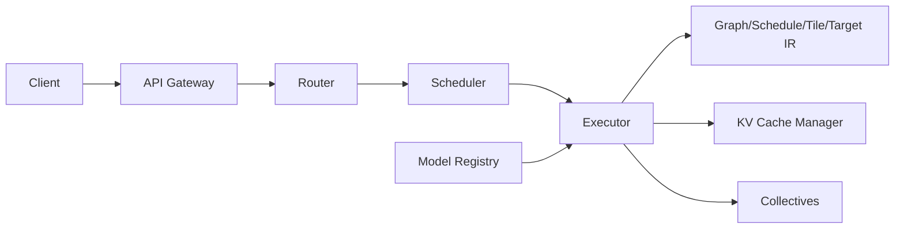

# Tessera Inference Server Guide

The Tessera Inference Server (TIS) is the production serving design for models
compiled through Tessera’s IR stack:

```text
Graph IR -> Schedule IR -> Tile IR -> Target IR
```

TIS is meant to provide:

- Shape-specialized compiled graphs with autotuned schedules.
- Distributed execution over DP/TP/PP meshes.
- Continuous batching and token scheduling for LLM decode.
- Paged KV caches with HBM/host spill policies.
- BF16/FP16/FP8/INT8 serving with explicit numerics policies.
- OpenAI-style HTTP/gRPC API compatibility.
- Observability, multi-tenancy, and SLA/SLO controls.

The current Python foundation is `tessera.server`: package manifest validation,
package loading, scheduler metadata, KV cache accounting, route/model
registration, health, and metrics stubs. It is not yet a network server.

---

## 1. Goals And Non-Goals

**Normative goals:**

- Predictable latency under load through continuous batching and admission
  control.
- Deterministic numerics option for regulatory and replay-sensitive workloads.
- Scale-out through distributed meshes and collective semantics.
- Hot-swap models through versioned package manifests and registries.

**Non-goals:**

- Training orchestration.
- General long-running DAG scheduling.
- Arbitrary user device code at runtime.

---

## 2. Architecture

Core components:

| Component | Responsibility |
|-----------|----------------|
| API Gateway | HTTP/gRPC, auth, request shaping, streaming |
| Router | Multi-model routing, canaries, cost-aware placement |
| Scheduler | Microbatching, token scheduling, priority lanes |
| Executor | Loads `.tspkg`, validates IR, runs compiled graphs |
| KV Cache Manager | Paged KV allocation, eviction, host spill |
| Collectives | NCCL/RCCL/oneCCL/MPI per mesh policy |
| Registry | Versioned model packages, schedules, kernels, weights |



---

## 3. Model Packaging

A Tessera package is a directory ending in `.tspkg`:

```text
model.tspkg/
  manifest.yaml
  graph_ir.tssa
  schedule_cache/
  tile_kernels/
  weights/
    shard_tp0_pp0.safetensors
    shard_tp1_pp0.safetensors
  tokenizer/
  assets/
```

### 3.1 Manifest Fields

**Normative fields:**

```yaml
name: gpt-oss-7b
version: 1.3.2
entry: main.decode_graph
mesh: {tp: 2, pp: 1, dp: 1}
dtypes: [bf16, fp16, fp32]
kv_cache:
  pages: 256
  page_size: 2MiB
  swap: host_pinned
autotune:
  required: true
  min_arch: sm90
compat:
  api: openai-v1
```

Validation rules:

- `name`, `version`, and `entry` are required.
- `mesh` axes must be positive integers.
- `dtypes` must be non-empty.
- `kv_cache.pages > 0`.
- `kv_cache.page_size` must parse to bytes.
- `compat.api` must be `openai-v1` or `tessera-v1`.

Python:

```python
from tessera import server

pkg = server.load_package("/models/gpt-oss-7b.tspkg")
print(pkg.manifest.entry)
```

---

## 4. Runtime Backends And Placement

Supported backend families:

- PTX for NVIDIA.
- ROCm for AMD.
- Level Zero for Intel.
- CPU fallback.

Placement should use runtime capabilities:

```python
caps = server.capabilities(
    backend="ptx",
    arch="sm90",
    tensor_cores=True,
    fp8=True,
    hbm_gb=80,
    nvlink=True,
)
```

The router should place models by:

- Required dtype support.
- HBM capacity and KV cache pressure.
- NVLink/NVSwitch domain.
- Tensor Core / FP8 support.
- Current queue and p99 latency.

On first load, TIS validates IR and either loads precompiled kernels or JITs and
autotunes missing schedules. Tuning results are persisted by model, arch, shape,
dtype, numerics policy, layout, and movement plan.

---

## 5. Scheduling And Batching

LLM decode should use continuous/token batching:

- Merge compatible requests each decode step.
- Resize batches to hit latency SLOs.
- Support priority lanes.
- Support speculative decoding with fallback.

Python metadata surface:

```python
sched = server.scheduler(policy="continuous_batch", target_p99_ms=150)

with sched.session(model="gpt-oss-7b") as sess:
    for delta in sess.generate(messages, max_tokens=256):
        yield delta
```

Encoder-style workloads should use sequence batching and padding budgets rather
than token-by-token scheduling.

Kernel graph capture should bucket by hot shapes such as sequence length, head
dimension, and batch-token count to maximize replay reuse.

---

## 6. KV Cache Management

TIS uses paged KV cache state:

```python
cfg = server.KVCacheConfig(pages=4096, page_size="2MiB", swap="host_pinned")
kv = server.KVCacheManager(cfg)
kv.allocate(128)
kv.evict(64)
```

Production policy:

- Fixed-size HBM pages.
- LRU/clock replacement.
- Spill to pinned host memory when configured.
- Optional cross-request cache sharing for continued chats.
- Topology-aware placement and peer access for multi-GPU decode.

Attention kernels should prefer FlashAttention with FP32 accumulation for
stability unless a numeric policy explicitly permits a lower-precision path.

---

## 7. Quantization And Formats

Supported serving dtypes:

- BF16/FP16 for standard serving.
- FP8 where runtime capabilities allow it.
- INT8 weight-only or activation-aware quantization.

Rules:

- Accumulation precision must be explicit.
- Per-channel scales must be in the package manifest or weight metadata.
- Dequantization should fuse into matmul or epilogue Schedule IR.
- Runtime amax refinement is allowed only when the manifest permits it.
- Safe fallback to BF16/FP16 must be available for unsupported hardware.

---

## 8. Distributed Execution

Meshes use TP x PP x DP axes:

- TP: tensor-parallel shards and collectives.
- PP: pipeline stages and microbatch schedule.
- DP: replicated model instances or data-parallel groups.

Collectives should use deterministic trees when deterministic mode is enabled.
Async overlap is allowed only when the memory/effect model proves it safe.

Shard consistency is verified through `ShardSpec` and shape-system contracts.

---

## 9. APIs

OpenAI-compatible subset:

```http
POST /v1/chat/completions
POST /v1/completions
POST /v1/embeddings
GET  /v1/healthz
GET  /v1/models
POST /v1/tokenize
```

Request example:

```json
{
  "model": "gpt-oss-7b",
  "messages": [{"role": "user", "content": "Hello"}],
  "temperature": 0.7,
  "stream": true,
  "max_tokens": 256
}
```

Streaming may use Server-Sent Events, WebSockets, or bidirectional gRPC.

The current Python `App` records model loaders and routes:

```python
from tessera import server

app = server.App(config="tis.yaml")

@app.model("/models/gpt-oss-7b")
def load_model(pkg):
    return server.load_package(pkg)

@app.route("/v1/chat/completions", stream=True)
def chat(req):
    ...
```

---

## 10. Observability And SRE

Metrics:

- p50/p90/p99 latency by route, model, stage, and token phase.
- Tokens/sec and requests/sec.
- GPU utilization and HBM usage.
- KV cache hit rate, evictions, spill bytes.
- Batch size and batch tokens.
- Failed requests, OOM count, collective timeout count.
- Autotune miss/fallback count.

Tracing:

- queueing -> batching -> graph launch -> collectives -> decode stream

Logging:

- Per-request sampling.
- Redaction policies.
- NaN/Inf anomaly reports.

`App.healthz()` should report readiness only when IR is loaded, communicator is
ready, and scheduler/batcher are live.

---

## 11. Security And Multi-Tenancy

Production deployments should enforce:

- mTLS or OIDC authentication.
- Per-tenant quotas and API-key rate limits.
- Process-level isolation per tenant/model where required.
- MIG/GPU partition isolation where supported.
- Package allowlists and no arbitrary runtime device code.

---

## 12. Deployment Patterns

Single-node:

- One process per NVLink domain or one process with multiple executors.
- Shared communicator across local GPUs.

Multi-node:

- Mesh spans nodes.
- Use NCCL/RCCL/oneCCL with IB/RoCE.
- Deterministic collectives for strict replay workloads.

Kubernetes config sketch:

```yaml
server:
  port: 8080
  backend: ptx
  numerics: deterministic
models:
  - package: s3://models/gpt-oss-7b.tspkg
    mesh: {tp: 2, pp: 1, dp: 1}
    instances: 2
scheduler:
  target_p99_ms: 150
  max_batch_tokens: 2048
  speculative:
    enabled: true
    draft_model: gpt-oss-1b
kv_cache:
  pages: 4096
  page_size: 2MiB
  spill: host_pinned
observability:
  prometheus: {path: /metrics}
security:
  auth: oidc
```

---

## 13. Performance Playbook

- Capture graph launches for hot shape buckets.
- Autotune schedules per architecture and persist caches.
- Warm up models on startup.
- Use pinned host memory for KV spill.
- Overlap KV DMA with compute.
- Coalesce collectives and use reduce-scatter/all-gather where natural.
- Quantize with FP8/INT8 only when capability guards and accuracy policy allow.

---

## 14. Failure Modes And Recovery

| Failure | Recovery |
|---------|----------|
| OOM | Shrink batch/max tokens, evict KV pages, fallback dtype |
| Collective timeout | Abort batch, reset communicator, quarantine node |
| Autotune miss | Use safe schedule and queue background tune |
| NaN/Inf | Reset request, log prompt hash, enable strict numerics |
| KV pressure | Spill cold pages or reject/admit by priority |

TIS should integrate with `tessera.fault`, `tessera.checkpoint`, and
`tessera.elastic` for serving-side recovery where model state is mutable.

---

## 15. Roadmap

- Multi-draft speculative decoding.
- KV compression for long contexts.
- CPU prefill offload with GPU decode.
- Weighted fair queueing and deficit round-robin tenant scheduling.
- Triton/MLServer adapters.
- HF Transformers conversion into `.tspkg`.

---

## Appendix A: Packaging Command

```bash
tessera pack \
  --from-hf gpt2 \
  --name gpt-oss-7b \
  --dtype bf16 \
  --mesh "tp=2,pp=1,dp=1" \
  --out model.tspkg
```

---

## Appendix B: Health And Metrics

`/healthz` returns success only when:

- Package manifest is valid.
- IR is loaded.
- Communicator is ready.
- Scheduler/batcher is live.

`/metrics` should expose Prometheus counters/gauges/histograms for SRE
dashboards.
